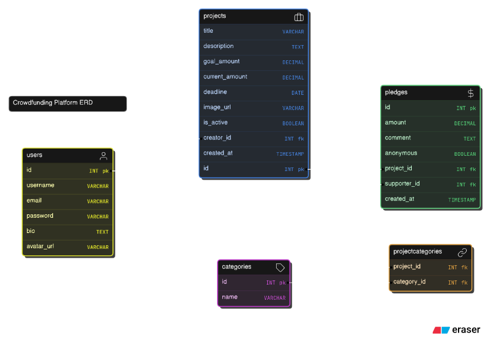
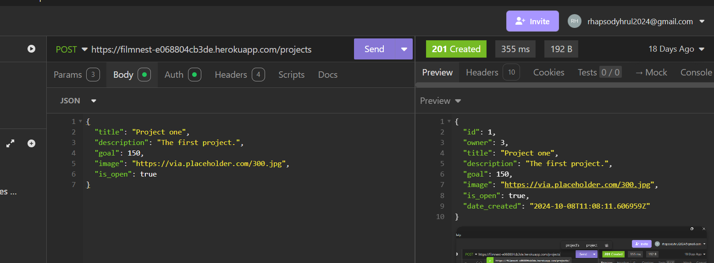
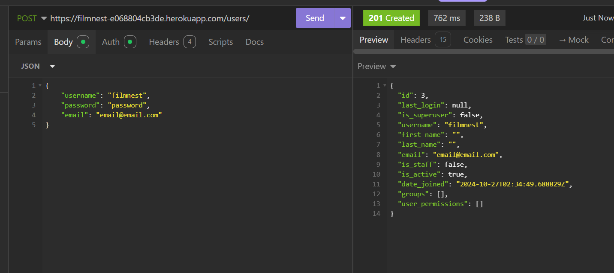
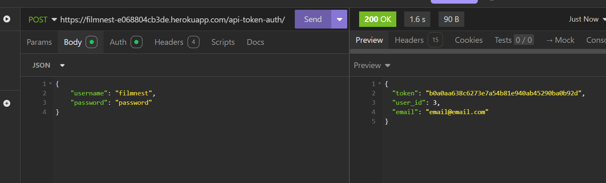
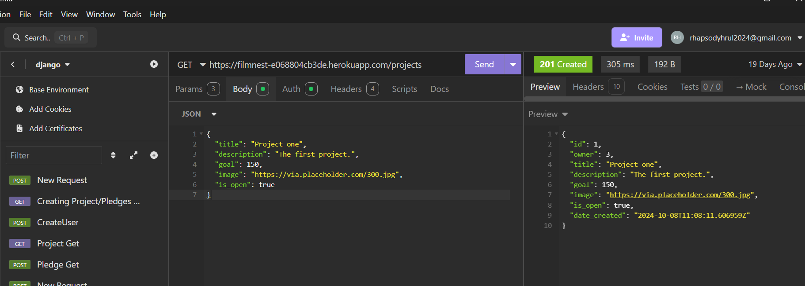
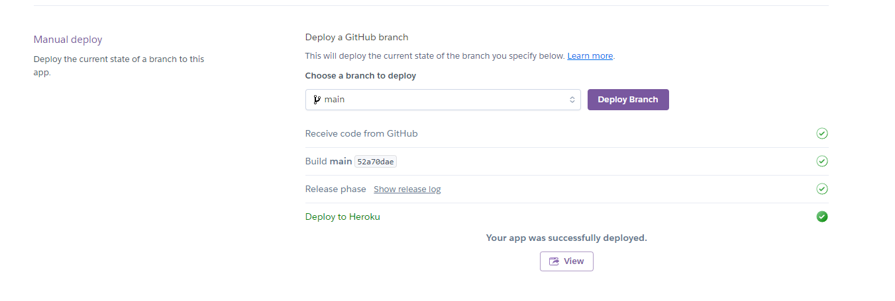

# crowdfunding_back_end_sp
A repo to contain my She Codes Crowdfunding back end project 
https://github.com/SiciliaCodes/crowdfunding_back_end_sp

# Crowdfunding Back End
Sicilia Perumalsamy 

## Planning:
### Concept/Name
FilmNest - A crowdfunding platform where budding filmmakers can "hatch" their creative ideas and raise funds for their film projects.

### Intended Audience/User Stories
Filmmakers (Project Creators)
Film enthusiasts (Backers)
Film industry professionals
Film students

### API Spec
| URL | HTTP Method | Purpose  | Request Body | Success Response Code | Authentication/Authorisation |
| --- | ----------- | -------  | ------------ | --------------------- | ---------------------------- |
|  /api/projects   |  GET           |    List all projects     |  -       |      200        |           None            |     -                         |
|  /api/projects   |   POST          |     Create project    |        {title, description, goal_amount, timeline} |     201         |      Token required                 |                              |
|  /api/projects/{id}   |   GET          |     View project    |    -     |      200        |                None       |                              |
|  /api/projects/{id}   |     PUT        |   Update project      |   {title, description, goal_amount, timeline}      |       200       |       Token + Owner                |                              |
|  /api/projects/{id}  |     DELETE        |    Delete project     |   -      |       204       |         Token + Owner              |                              |
|  /api/pledges   |    POST         |  Create pledge       |    {amount, project_id, comment}     |    201          |        Token required               |                              |
|  /api/users   |       POST      |    Create account     |  {username, email, password}       |       201       |          None             |                              |
|  /api/users/login |     POST        | User login        | {username, password}        |     200         |           None            |                              |

### DB Schema

##
Here's a summary of the step by step instructions: 
1. To Register:

Send POST request to /api/users/ with:

    Username
    Email
    Password

System returns user ID and details

    To Login:

Send POST request to /api/users/login/ with:

    Username
    Password

System returns authentication token

2. To Create Project:

Send POST request to /api/projects/ with:

    Authorisation token in header
    Project title
    Description
    Goal amount
    Timeline

System returns project ID and details
##

Link to successfully deployed project: **Previously deployed during project assessment; deployment no longer active.**

